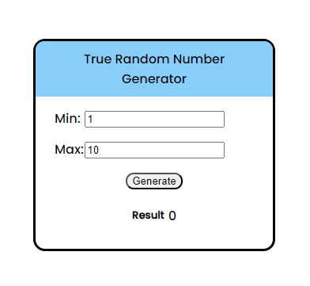
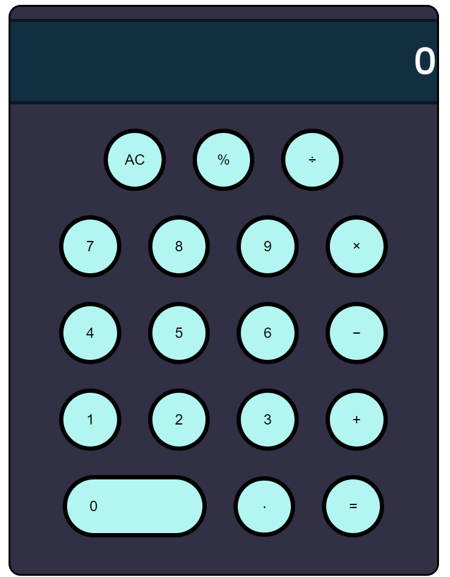

# html_practice
all_html_files
# Color Web

https://alex18ss.github.io/html_practice/colored-web/

# Generator

  

https://alex18ss.github.io/html_practice/generator 

# Calculator

  

https://alex18ss.github.io/html_practice/calculator/

<h3><b>Please, use only a computer to view pages</b></h3>